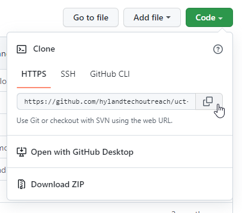
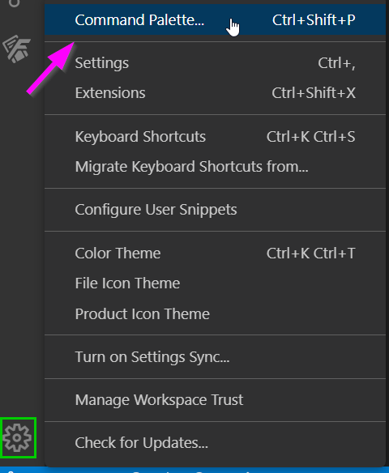
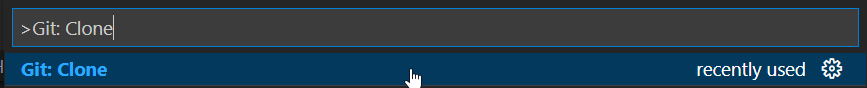
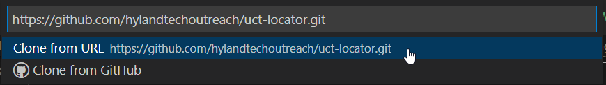
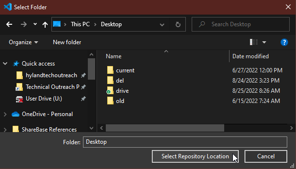
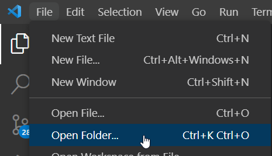

# Git - Local Setup
To complete this activity, you should have a GitHub account and a repository to use. There are instructions here for working with Visual Studio Code, as well as command line instructions. There are several other Git GUIs and integrations, but the options below are recommended.

## Downloading and Installing Git
In order to actually clone a GitHub Repository locally, you will have to download and install Git.

- On a Mac or Linux machine, download Git from here: https://git-scm.com/downloads
- On a Windows machine, download Git from here: https://gitforwindows.org/
    - This comes with Git BASH, a command-line utility

## Cloning the Repository
Once you have everything downloaded and installed, you can clone a repository on your local machine to play around with it!  A **clone** is a copy of a repository that lives on your computer instead of on a website's server somewhere.

1. On the right side of your repository page, click the green **Code** button
    - Make sure you are on the **HTTPS** menu
1. Click the _copy_ icon to copy your repository URL to your clipboard  
    

Depending on which tool you are using, follow the instructions in one of the sections below to complete the cloning process.

### Cloning in Visual Studio Code
To start, download and install [Visual Studio Code](https://code.visualstudio.com/). If you also have installed Git on your machine, Visual Studio Code has built-in Git tools you can use.

1. Open Visual Studio Code
1. Click the "Settings" gear icon in the lower left
1. From there, click "Command Palette..." to open the Command Palette  
    
1. Type in ">Git: Clone" and press `Enter` to execute the command  
    
1. Paste in your repository URL and press `Enter` to confirm  
    
1. Navigate to a suitable location for your repository folder, and click the 
Select Repository Location" button  
    
1. Once your repository is cloned, open the "File" menu from the top left in Visual Studio Code
1. Click on the "Open Folder..." option  
    
1. Locate the new repository folder, and click the "Select Folder" button  
    

That's it! Now you have a local clone of your repository.

### Cloning via the Command Line
If you have Git Bash installed on your machine (or another shell), you can use that for all Git commands.

1. Open your shell application (e.g. Git Bash)
1. Change your directory to wherever you'd like the repository to live
    ```bash
    cd /path/to/folder/
    ```
1. Use the `clone` command to clone the repository (paste in the repository's url after `clone`)
    ```bash
    git clone https://github.com/YOUR_REPO_URL.git
    ```

That's it! Now you have a local clone of your repository.
