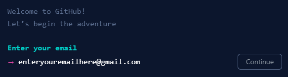
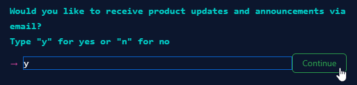
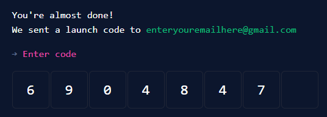

# Make a GitHub Account
GitHub is a web-based hosting service for version control using Git.  It allows users to view, edit, and store source code online.  It is used by developers all over the world to collaborate on projects and showcase their creations.

To get started, follow the steps below to create a GitHub account!

1. [Click here to go to the Join GitHub page](https://github.com/signup)
1. In the field that appears, enter your e-mail address, and click the "Continue" button  
    
1. In the next field, enter a password, and click the "Continue" button  
    
1. In the next field, enter a username, and click the "Continue" button  
    
1. In the next field, enter "y" or "n" and then click the "Continue" button  
    
1. Complete the puzzle to verify your humanity  
    
1. Click the "Create account" button
    
1. Check your email - you should have received a launch code  
    
1. Back in GitHub, enter that launch code to verify the account  
    

That's it! Now you should have a verified GitHub account. Make sure to remember your login credentials and your username!
