# Git - Merge Changes
Merging changes is one of the most crucial aspects of collaborating on a git project. When multiple developers are working on the same codebase simultaneously, it can be difficult to keep things running smoothly. This demonstration simulates a merge conflict, and shows how it is possible to resolve issues of this nature.

## The Starter Repository
For this example, we begin with a [repository](https://github.com/hto-projects/merge-demo-start/) that has some "bugs" to fix. For the sake of simplicity, these bugs will be semantic/spelling mistakes within a block of text. These errors are all within a file named **Frankenstein.md**, which contains the first few paragraphs of Mary Shelley's Frankenstein. 

Here are the errors, grouped into three distinct categories:

#### 1. British Spellings
- "splendour" should be "splendor"
- "tranquillise" should be "tranquilize"
- "favourite" should be "favorite"

#### 2. Name Mistakes
- "Maggie" should be "Margaret"
- "Bart" should be "Homer"

#### 3. Spelling Errors
- "rejoce" should be "rejoice"
- "abtain" should be "obtain"
- "affusions" should be "effusions"

### Importing the Repository
To create a working copy of the **merge-demo-start** repository, it will be necessary to import it. Follow these steps:

1. [Click here to go to GitHub](https://github.com)
1. In the upper right, click on the "+" dropdown and select "Import repository"  
    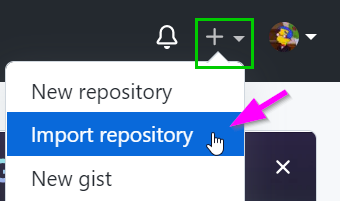
1. On the next page, paste in the **merge-demo-start** URL for "Your old repository's clone URL"
    - https://github.com/hto-projects/merge-demo-start/
1. Enter **merge-demo** for the Repository Name
1. Click the "Begin import" button  
    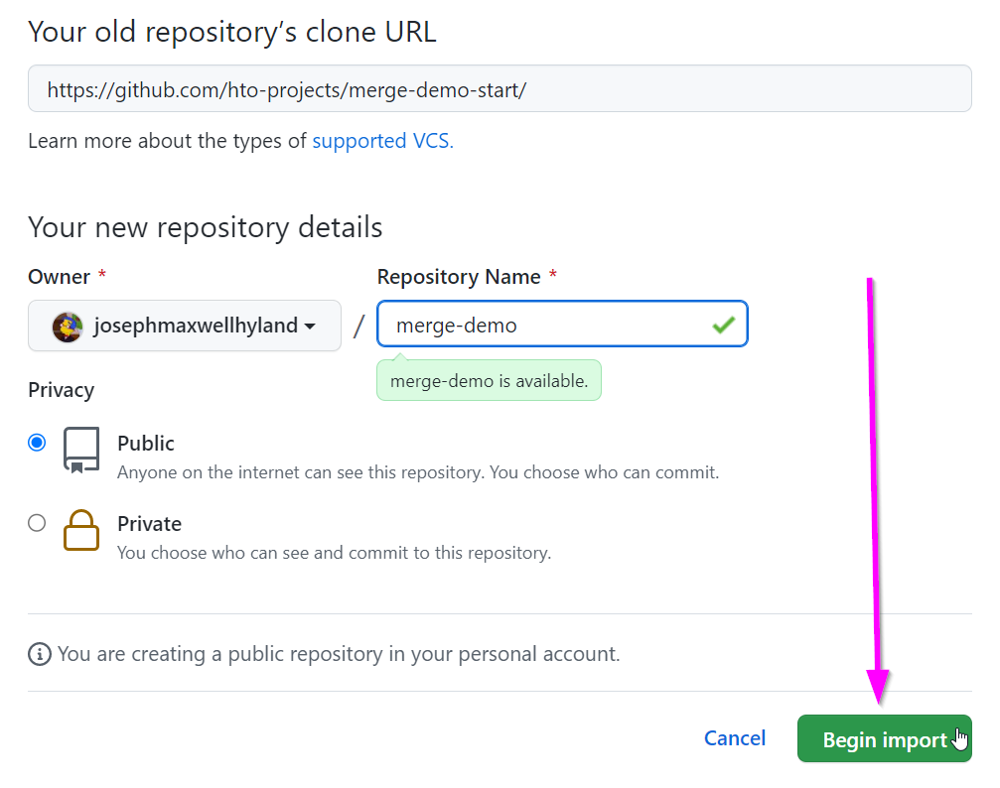
1. Wait for the import to complete
1. Once the import is done, click the link to your new repository!  
    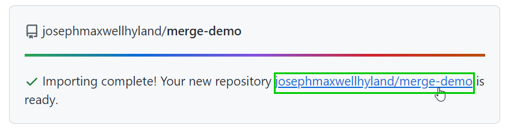

## Fixing the Errors in a Branch
Now, imagine there are a team of people dedicated to this project. Each individual is assigned one group of errors to fix, and they do this using _feature branches_. Let's call one of these people **Alice**, and another one **Bob**. **Alice** will work on Americanizing the text, and **Bob** will work on the name mistakes.

All of these steps can be completed either on a local clone of the repository, _or_ on the web through [GitHub.com](https://github.com/). Visual Studio Code is recommended. If a local clone is to be used, begin by cloning the repository locally ([these instructions](LocalSetup.md) may be helpful). Note that it is possible to open a new terminal in VS Code via the "Terminal" menu.

1. On the **merge-demo** repository on GitHub, create a new _branch_ named `alice-americanize-spelling`
    - This is where Alice will do her work
    - Command Line: `git checkout -b alice-americanize-spelling`
    - VS Code: click current branch in lower left, enter new branch name
1. On the new branch, open the **Frankenstein.md** file for editing
1. Fix the three British spelling mistakes, and commit the changes
    - Command Line: `git add .`, `git commit -m "american spellings"`, `git push`
    - VS Code: click Source Control icon on the left menu, stage changes, commit changes, publish branch
1. On the **merge-demo** repository, switch back to the `develop` branch
    - Command Line: `git checkout develop`
    - click current branch in lower left, select `develop`
1. There, create another new branch named `bob-fix-names`
    - This is where Bob will do his work
    - Command Line: `git checkout -b bob-fix-names`
    - VS Code: click current branch in lower left, enter new branch name
1. On the new branch, open the **Frankenstein.md** file for editing
1. Fix the two name mistakes, and commit the changes
    - Command Line: `git add .`, `git commit -m "new names"`, `git push`
    - VS Code: click Source Control icon on the left menu, stage changes, commit changes, push changes

Now there are two branches, each containing _some_ of the necessary bug fixes. The goal is to get both sets of changes into the `develop` branch, WITHOUT them interfering with each other.

>Note: this example may seem contrived, but remember it is simply for demonstration purposes. In a real project, the changes would likely be much more complex.

## Merging Alice's Branch
The first part should be fairly straightforward - since both feature branches were directly copied from `develop`, and there are no additional changes to `develop`, there should be no conflicts with the first merge. Start with the `alice-americanize-spelling` branch.

Merging the branch via pull request will take place via [GitHub.com](https://github.com/).

1. Go to the "Pull requests" tab at the top of the page  
    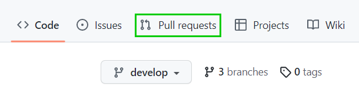
1. Click on "New pull request"  
    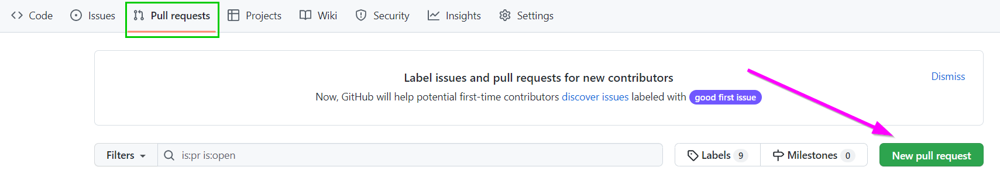
1. For the "base" branch, keep `develop`
1. For the "compare" branch, select `alice-americanize-spelling`  
    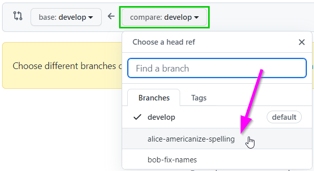
1. Check out the changes and click the "Create pull request" button  
    
1. On the next page, click the "Create pull request" button  
    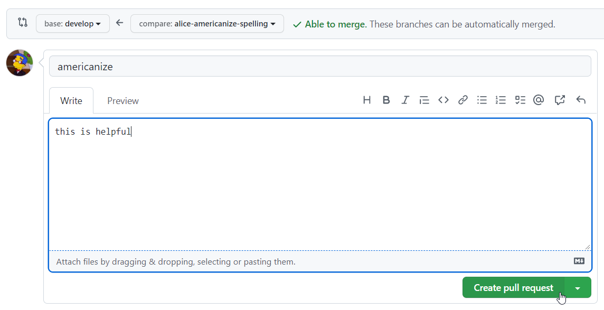
1. On the next page, click the "Merge pull request" button  
    
    - Note: in the real world, pull requests should be reviewed by a team before merging
1. Click the "Confirm merge" button to merge the changes into `develop`  
    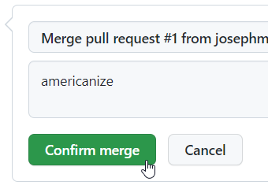
1. Click the "Delete branch" button to delete the `alice-americanize-spelling` branch  
    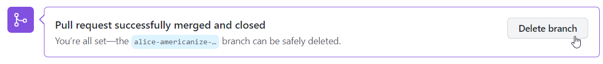

Go back to the Code tab, and on the `develop` branch, check out the **Frankenstein.md** files. All the spellings should be Americanized - the changes from Alice's feature branch should be there!

## Creating a Pull Request for Bob's Branch
So Alice has successfully merged her changes into the `develop` branch, but Bob's are still isolated in his branch. He needs a Pull Request to get those changes into the codebase! This is doable via GitHub; it will be very similar to creating the Pull Request for Alice.

1. Go to the "Pull requests" tab at the top of the page  
    
1. Click on "New pull request"  
    
1. For the "base" branch, keep `develop`
1. For the "compare" branch, select `bob-fix-names`  
    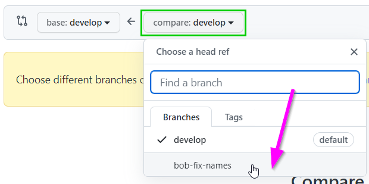
1. Check out the changes and click the "Create pull request" button  
    
1. On the next page, click the "Create pull request" button  
    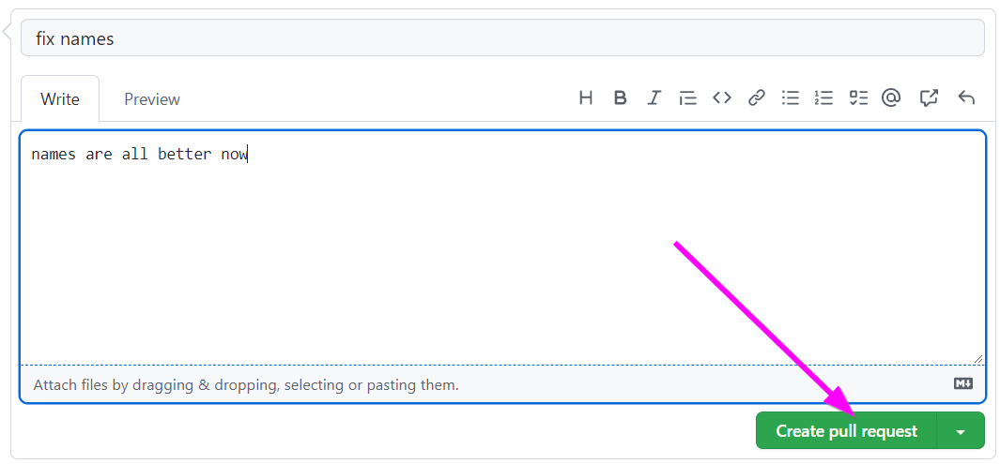

Here, the problem becomes apparent: Bob's branch has conflicts with the `develop` branch! His changes cannot be merged into the codebase without dealing with these merge conflicts.

## Merging `develop` into `bob-fix-names`
In order to merge Bob's changes into the `develop` branch, it will first be necessary to merge the latest version of `develop` into `bob-fix-names`.

1. Open up the local clone of the repository in VS Code
1. Make sure to be on the `develop` branch
    - Command Line: `git checkout develop`
    - VS Code: click current branch in lower left, select `develop`
1. Pull the latest changes from the server
    - Command Line: `git pull`
    - VS Code: click Source Control icon on the left menu, three dots, Pull
1. Switch to the `bob-fix-names` branch
    - Command Line: `git checkout bob-fix-names`
    - VS Code: click current branch in lower left, select `bob-fix-names`
1. Open the **Frankenstein.md** file for editing
    - Make sure the name fixes are still there
    - The Americanized spelling fixes should _not_ be there
1. Attempt to merge in the `develop` branch by entering `git merge develop`
    - An error should appear, saying that there are merge conflicts
1. Open up the **Frankenstein.md** file to see the merge conflict

This is the hard part; it will be necessary to go into the **Frankenstein.md** file, and figure out how the conflicting changes merge together.

## Dealing with the Conflict
The syntax for merge conflicts is a little weird, but it basically shows you the change coming from one side compared to the change coming from the other side.

Under `<<<<<<< HEAD` is the text as it currently is on the present branch. In the case of the `bob-fix-names` branch, it has properly swapped "Maggie" out for "Margaret", but it still has the British spelling of "splendour."

The `=======` separates the two versions, with one being above and one being below.

The `>>>>>>> develop` indicates the end of the second version of the text. In the case of the `develop` branch, it has the old name "Maggie," but it has the fix for "splendor."

The goal, then, is to take the good parts of each version, mash them together into one final version, and get rid of the `<<<<<<< HEAD`, `=======`, `>>>>>>> develop`, and old versions. Ultimately, the fix should replace this:

```
<<<<<<< HEAD
There, Margaret, the sun is for ever visible, its broad disk just skirting the horizon and diffusing a perpetual splendour.
=======
There, Maggie, the sun is for ever visible, its broad disk just skirting the horizon and diffusing a perpetual splendor.
>>>>>>> develop
```

with this:

```
There, Margaret, the sun is for ever visible, its broad disk just skirting the horizon and diffusing a perpetual splendor.
```

Essentially, in this case, it will make sense to accept both changes; the one from the `develop` branch (originating from Alice) _and_ the one from the `bob-fix-names` branch (originating from Bob).

>Note: in a real project, it may not be so clear cut; some additional work may be required to make sure all the code works together.

Consolidate the changes using VS Code:

1. Click the Source Control icon on the left to open the Source Control pane
1. Click the **Frankenstein.md** file to see the "Merge Changes"
1. For the conflict, select both the left change _and_ the right change
1. Notice that in the pane underneath, the "Result" includes both the correct name ("Margaret") and the correct American spelling ("splendor").
1. Click the "Accept Merge" button to complete the merge

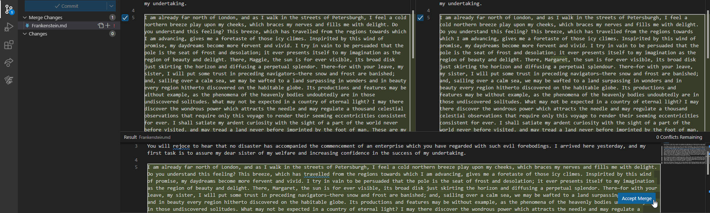

## Pushing Up the Resolution
Once the merge conflict has been resolved, it's time to push it up.

1. Make sure the **Frankenstein.md** file is saved
1. In the Source Control pane, click the "Commit" button
1. After that, click the "Sync Changes" button that should appear
1. Go to [GitHub](https://github.com) and check on the `bob-fix-names` branch in the **merge-demo** repository
    - It should now be **2 commits ahead** of `develop`, and no commits behind!

## Merging Bob's Pull Request
Now the Pull Request should be ready for merging!

1. On GitHub, click on the "Pull requests" tab
1. Click on Bob's Pull Request
1. Click the "Merge pull request" button, then the "Confirm merge" button
1. Finally, click the "Delete branch" button

Head back to the main repository page - there should only be the `develop` branch, and all changes from Alice and Bob should be in the **Frankenstein.md** file!

## OPTIONAL: Fixing the Additional Errors
There are still some bugs in the **Frankenstein.md** file! For some added practice, fix the additional spelling errors by following the proper process.

1. On the **merge-demo** repository in GitHub, create a new branch named `fix-spelling`
1. Make the changes to the **Frankenstein.md** file on the new branch
1. Create a pull request from the `fix-spelling` branch into the `develop` branch
1. Merge in the changes!
