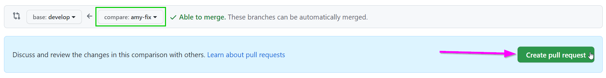
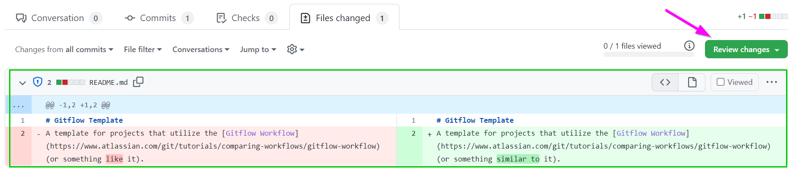
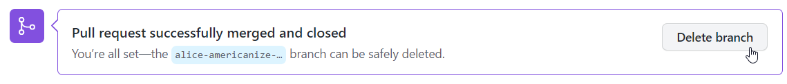

# Pull Request Follow-Along
Follow these instructions to practice making a contribution to a codebase!

### Note
To complete this activity, make sure to have a [local clone](LocalSetup.md) of a repository set up and ready to go. An instructor should make sure you have a repository for you or for your team's project.

If necessary, use [this template](https://github.com/hto-projects/gitflow-template) to create a test repository for practice purposes. Simply click on the "Use this template" button, and once the new repository has been created, clone it. 

### The Template Repository
If using the [`hto-projects/gitflow-template`](https://github.com/hto-projects/gitflow-template) template repository, there are some ready-to-go issues. Each text file in the **PullTestPoems** folder has an error that must be fixed:

- **16BitIntel8088Chip.txt**: `Koypro` should be `Kaypro`
- **ADreamWithinADream.txt**: last line, `bean` should be `dream`
- **Alone.txt**: `alne` should be `alone`
- **AMomentOfHappiness.txt**: `birdos` should be `birds`
- **ARedRedRose.txt**: `Boourns` should be `Burns`
- **AutumnMovement.txt**: `Sandberg` should be `Sandburg`
- **AWorldOfDew.txt**: `strugle` should be `struggle`
- **ClenchedSoul.txt**: `red` should be `blue`
- **DontHesitate.txt**: `thats` should be `that’s`
- **DustOfSnow.txt**: `food` should be `mood`
- **Harlem.txt**: `Hughesy` should be `Hughes`
- **HopeIsTheThingWithFeathers**: `woarm` should be `warm`
- **No1.txt**: `Jhon` should be `John`
- **Sick.txt**: `byShel` should be `by Shel`
- **Sonnet18.txt**: `summer’s hay` should be `summer’s day`
- **TheRedWheelbarrow.txt**: `carlos` should be `Carlos`
- **ThereWillComeSoftRains.txt**: `tremolus` should be `tremulous`
- **TheTiger.txt**: `🦁` should be `🐯`
- **TheTyger.txt**: `skis` should be `skies`
- **TooManyDaves.txt**: `Raves` should be `Daves`
- **WeHaveNotLongToLove.txt**: `Kentucky` should be `Tennessee`

Each person should work on fixing one of these issues! Make sure if you're working on a team that each team member chooses a different file - this will help avoid merge conflicts and repeated work.

## Fixing Your Issue - Branching & Pushing
The first step will be to make the changes to fix your assigned issue, and push them up to GitHub. The changes themselves do not matter much - they should be simple and trivial.

1. Open Visual Studio Code, and open the local clone of the repository
1. Create a new branch in the local repository using your name, e.g., `amy-fix`
    - Command Line: `git checkout -b amy-fix`
    - VS Code: click branch name in lower left, enter `amy-fix`, select "+ Create new branch..."
    - _Note: Be sure to name your branches well!_
1. Open your file for editing (each person should have chosen their own file)
1. Fix the error as listed above, and save the file
1. View and stage your changes
    - Command Line: `git add .`
    - VS Code: open Source Control pane, click on the changed file to see changes, click the "+" to stage them
1. Commit your changes with a message, e.g., "fix spelling"
    - Command Line: `git commit -m "fix spelling"`
    - VS Code: in Source Control, enter "fix spelling" in the "Message" box, and click "Commit"
    - _Note: Be sure to enter clear commit messages!_
1. Publish your branch
    - Command Line: `git push --set-upstream origin amy-fix`
    - VS Code: in Source Control, click "Publish Branch"

Once you've completed these steps, you should be able to take a look at your repository on the web at [GitHub](https://github.com/), and see your branch with the changes!

## Making a Pull Request
The next step is to create a Pull Request to merge _your_ branch (e.g., `amy-fix`) into the `develop` branch.

1. Open up your repository on [GitHub](https://github.com/)
1. At the top, click on the "Pull requests" tab, and click the "New pull request" button  
    
1. Keep the **base** branch as `develop`
1. Set the **compare** branch to your branch (e.g., `amy-fix`)
1. Click the "Create pull request" button  
    
1. Enter a detailed comment, and click the "Create pull request" button  
    

Now your change should be ready to merge!

## Merging the Pull Request
At this point, the team will discuss the proposed changes in the Pull Request. Typically, the `develop` branch will be protected, so that it will only be possible to merge Pull Requests with an approval from another team member. Thus, this next part may require assistance from a fellow student.

It is typically bad practice to merge your own Pull Requests. It's always good to have someone else take a look at your work, give you feedback, and make sure everything is good to go.

1. Find the "Reviewers" section on the right side of the Pull Request page
1. Click the ⚙ icon
1. Enter the GitHub account name of a team member  
    

Now, it will be up to that team member to approve this request, and merge it into the codebase! The team member should:

1. Go to the Pull Request Page
1. If it is available, click the "Add your review" button
1. Otherwise, click the "Files Changed" tab  
    
1. Take a look at the changes to the files - make sure they are all good!
1. On the right side, click the "Review changes" button  
    
1. Enter a comment, (hopefully) select the "Approve" option, and click "Submit Review"  
    
1. Back on the Pull Request page, click the "Merge pull request" button  
    
1. Click the "Confirm merge" button  
    
1. Now the change has been merged! Last thing to do is delete the feature branch  
    

And that's it! Hopefully by the end of this walkthrough, you were able to successfully make a contribution to a GitHub repository.
